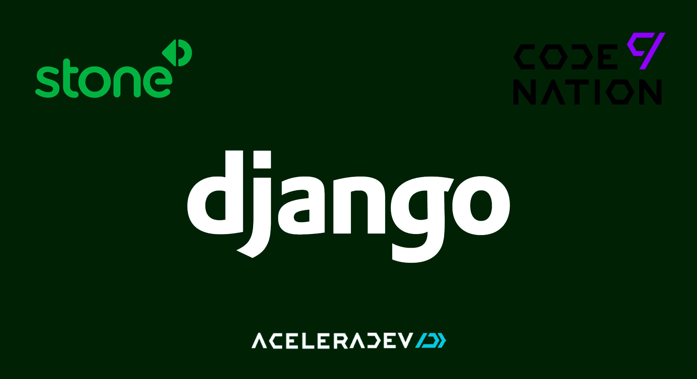

# API Central de erros - Projeto final aceleradev python 2020

Projeto final do aceleradev python desenvolvido pela [Codenation](https://www.codenation.dev/) em parceria com a [Stone Payments](https://www.stone.com.br/).



<!-- TABLE OF CONTENTS -->
<details open="open">
  <summary><strong>TABLE OF CONTENTS</strong></summary>
  <ul>
    <li><a href="#world_map-overview">Overview</a></li>
    <li><a href="#camera-screenshot">Screenshot</a></li>
    <li>
      <a href="#pushpin-getting-started">Getting Started</a>
      <ul>
        <li><a href="#key-requirements">Requirements</a></li>
        <li><a href="#minidisc-installation">Installation</a></li>
      </ul>
    </li>
    <li><a href="#hammer_and_wrench-setup">Setup</a></li>
    <li><a href="#stethoscope-tests">Tests</a></li>
    <li><a href="#desktop_computer-technologies">Technologies</a></li>
    <li><a href="#page_with_curl-license">License</a></li>
  </ul>
</details>

## :world_map: Overview

Em projetos modernos é cada vez mais comum o uso de arquiteturas baseadas em serviços ou microsserviços. Nestes ambientes complexos, erros podem surgir em diferentes camadas da aplicação (backend, frontend, mobile, desktop) e mesmo em serviços distintos. Desta forma, é muito importante que os desenvolvedores possam centralizar todos os registros de erros em um local, de onde podem monitorar e tomar decisões mais acertivas. Neste projeto vamos implementar um sistema para centralizar registros de erros de aplicações.

## :camera: Screenshot


## :pushpin: Getting Started

### :key: Requirements

- [Docker](https://www.docker.com/)
- [Python](https://www.python.org/)

### :minidisc: Installation
- Clonando o repositório

  ```sh
  
    $ git clone https://github.com/foschieraanderson/central-de-erros.git

  ```

## :hammer_and_wrench: Setup

- Gere uma secret_key para o seu projeto através do seu terminal
  
  ```sh
  # gerando SECRET_KEY
    $ python -c "import secrets; print(secrets.token_urlsafe())"
  ```
- No diretório do projeto edite o arquivo **docker-compose.yml**
  
  ```sh

  # Editando o arquivo docker-compose.yml

    # Cole a sua secret_key aqui
    - SECRET_KEY=YOUR_SECRET_KEY
    # Configure as credencias do banco de dados
    - POSTGRES_DB=YOUR_DB_NAME
    - POSTGRES_USER=YOUR_DB_USER
    - POSTGRES_PASSWORD=YOUR_DB_PASSWORD

  ```

- As mesmas credenciais de banco de dados devem ser usadas no arquivo **settings.py**
  
  ```PY

  DATABASES = {
    "default": {
        "ENGINE": "django.db.backends.postgresql",
        "NAME": "YOUR_DB_NAME",
        "USER": "YOUR_DB_USER",
        "PASSWORD": "YOUR_DB_PASSWORD",
        "HOST": "db",
        "PORT": 5432,
    }
  }

  ```

- Rodando o projeto
  
  ```sh
  # Fazendo build do projeto e subindo a máquina docker

   $ docker-compose up --build -d

  ``` 

- Criando as tabelas no banco de dados
  
  ```sh
  # Gravando as alterações

   $ docker-compose exec web python manage.py makemigrations

  # Gerando as tabelas

   $ docker-compose exec web python manage.py migrate

  ``` 

## :stethoscope: Tests

- Rodando os testes

  ```sh

  # Rodando a suíte de tests com pytest

  $ docker-compose exec web pytest

  ```

## :desktop_computer: Technologies

* [Docker](https://www.docker.com)
* [Python](https://www.python.org)
* [Django](https://www.djangoproject.com)
* [Django Rest Framework](https://www.django-rest-framework.org)
* [JWT - Json Web Token](https://jwt.io)
* [Postgres](https://www.postgresql.org)
* [Pytest](https://docs.pytest.org/en/stable)
* [Coverage](https://coverage.readthedocs.io/en/coverage-5.5)
* [Swagger](https://swagger.io)
* [Whitenoise](http://whitenoise.evans.io/en/stable)
* [Gunicorn](https://gunicorn.org)

## :page_with_curl: Licence
Este projeto está sob a licença do MIT. Consulte a [LICENSE](./LICENSE) para obter mais informações.

---

<h4 align="center"> <em>&lt;/&gt;</em> <a href="https://github.com/foschieraanderson" target="_blank">foschieraanderson</a> </h4>